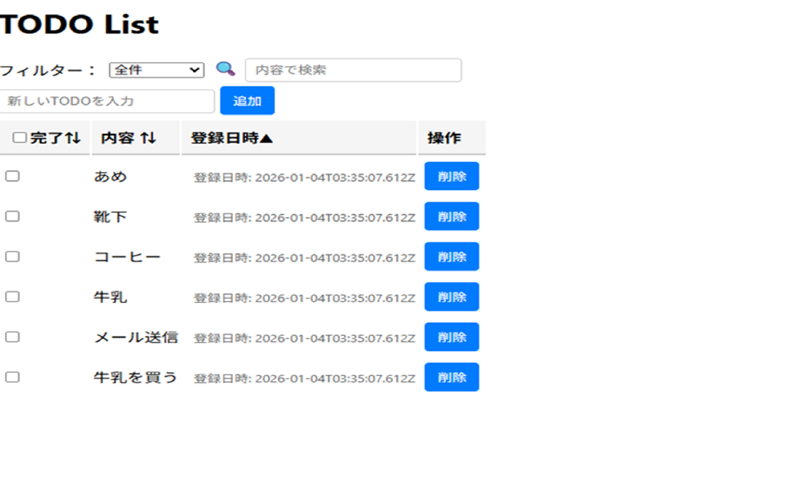

# My Todo App Monorepo

このリポジトリは、**React(TypeScript) フロントエンド** と  
**PHP（SQLite）バックエンド API** をまとめて管理する Monorepo です。

フロントとバックを一元管理することで、開発効率・保守性・可読性を高めています。

---

## 📁 プロジェクト構成

```
my-todo-monorepo/
├── frontend/   # React + TypeScript（UI）
└── backend/    # PHP + SQLite（API・DB・ログ）
```

---

## 🚀 開発環境の起動

### フロントエンド（React）
```
cd frontend
npm install
npm start
```

### バックエンド（PHP）
```
cd backend
php -S localhost:8000 -t public
```
※ backend ディレクトリ直下に index.php があるため、ドキュメントルートは `.` を指定しています。


---

## 🧰 ルートからまとめて起動（便利コマンド）

ルートの `package.json` に以下の scripts を定義しています：

```
npm run dev:frontend
npm run dev:backend
```

---

## 🗂️ backend 構成（PHP）

```
backend/
├── api/        # API エンドポイント（todos.php など）
├── data/       # SQLite DB（todos.db）
├── log/        # error.log / sql.log
├── css/        # スタイル（PHP版UI用）
├── js/         # JS（PHP版UI用）
└── src/        # PHPソース
```

### API 一覧（例）

| メソッド | エンドポイント | 説明 |
|---------|----------------|------|
| GET     | /api/todos.php | Todo 一覧取得 |
| POST    | /api/todos.php | Todo 追加 |
| PUT     | /api/todos.php | Todo 更新 |
| DELETE  | /api/todos.php | Todo 削除 |

---

## 🎨 frontend 構成（React + TypeScript）

```
frontend/
├── src/
│   ├── components/  # UI コンポーネント
│   ├── hooks/       # カスタムフック（useTodos など）
│   ├── types/       # 型定義
│   └── styles/      # styled-components
└── public/
```

---

## 📝 環境変数

### frontend
```
frontend/.env
REACT_APP_API_URL=http://mytodo.local:8080/api
```

### backend
```
DB_PATH=../data/todos.db    #未使用です。
DEBUG_MODE=True             #true = 開発モード, false = 本番モード
LOG_DIR=./log
```

---

## 🧪 テスト（必要に応じて）

React のテスト：
```
cd frontend
npm test
```

---

## 🧹 コード整形・Lint（任意）

```
cd frontend
npm run lint
npm run format
```

---

## 🗒️ 今後の TODO（例）

- [ ] API のエラーハンドリング強化
- [ ] ログのローテーション
- [ ] React 側の検索・フィルタ機能の改善
- [ ] GitHub Actions で CI/CD を追加

更新履歴
✅ 新規作成（2026/01/03）
✅ デバッグ環境の構築（2026/01/10）
✅ ログ出力の追加、フォルダ構成の改善（2026/01/11）
---

## 📄 ライセンス
このプロジェクトは個人学習用です。


